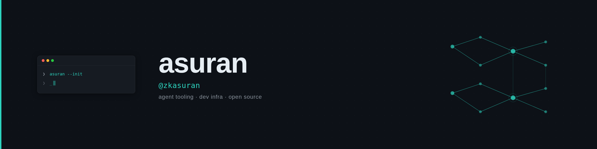

  

  I build agent tooling and developer infrastructure in <b>Python</b> and <b>Node</b>, and ship it to open source.

  
  

---

### Stack

also:    · asyncio, FastAPI, pytest, Playwright, Foundry

---

### What I'm building

| Project | What it does | Stack |
| --- | --- | --- |
| **[vibe-terminal](https://github.com/zkasuran/vibe-terminal)** | Route any model through any CLI. A cost-routing orchestration layer for terminal coding agents, so you can switch backends without switching tools. | Python |
| **[bitget-agentbench](https://github.com/zkasuran/bitget-agentbench)** | Backtest, score and risk-guard AI trading agents on real candle data. Reproducible scorecard and trade ledger, zero API keys. | Node / TypeScript |
| **[cmc-leverage-divergence](https://github.com/zkasuran/cmc-leverage-divergence)** | A funding-confirmed momentum strategy with a multi-asset, deflated-Sharpe backtest. Built as a CoinMarketCap agent skill. | Node / TypeScript |
| **[asuranity](https://github.com/zkasuran/asuranity)** | Universal blockchain vanity address generator supporting 50+ networks. | Node / JavaScript |

---

### Open source

Merged contributions to libraries I use:

- **[quimb#371](https://github.com/jcmgray/quimb/pull/371)** — added a PEPS circuit simulator to quimb, a tensor-network library.
- **[marqov-sdk#44](https://github.com/marqov-dev/marqov-sdk/pull/44)** — added a Rigetti hardware executor to the SDK.
- **[KQCircuits#143](https://github.com/iqm-finland/KQCircuits/pull/143)** — added a GUI export macro (KLayout / Python).
- **[PauliStrings.jl#110](https://github.com/nicolasloizeau/PauliStrings.jl/pull/110)** — OpenQASM circuit import.

In review: [mitiq#3041](https://github.com/unitaryfoundation/mitiq/pull/3041) · [QuEST#785](https://github.com/QuEST-Kit/QuEST/pull/785) · [zk-kit#420](https://github.com/zk-kit/zk-kit/pull/420) · [Circle arc-node#127](https://github.com/circlefin/arc-node/pull/127)

---

### How I work

AI-assisted and agent-driven. `vibe-terminal` is the tooling I built for exactly that: route any model through any CLI and keep the cost in check. Work ships with the project's own tests, lint and type-checks green, and AI help disclosed wherever a project asks for it.

---

  
  

