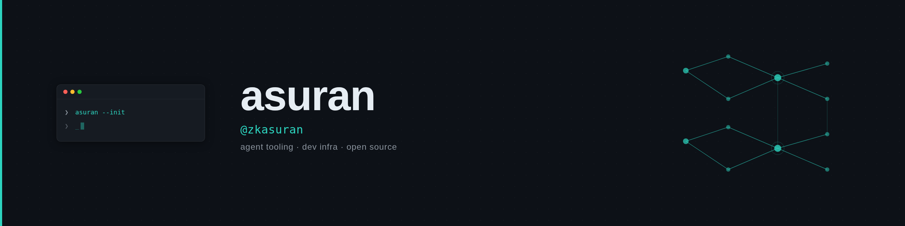

<div align="center">



[](https://x.com/zkasuran)
[](https://t.me/zkasuran)
[](https://discord.com/users/zkasuran)
[](mailto:zkasuran@gmail.com)

</div>

I build agent tooling and developer infrastructure, mostly in the open. Quantum open source,
onchain agents, CI tooling, language runtimes. I work AI-assisted and build the tooling for it,
disclosed wherever a project asks.

### Results

| | Program | Result |
| :-- | :-- | :-- |
| 🥇 | **unitaryHACK 2026**, Unitary Foundation | Ranked **#1**. Six merged PRs across six quantum projects, $745 in bounties. |
| 🥇 | **MiniMaxathon**, MiniMax x GMI Cloud | Won the Multimodality track with [Overhear](https://github.com/zkasuran/overhear), a topic to two-host audio episode generator. |
| 🥇 | **Bug Smash**, DEV x Sentry | Won **Best Use of Sentry** for a real telemetry bug in Sentry's own Python SDK ([writeup](https://dev.to/zkasuran/sentrys-trace-said-gemini-flash-latest-google-served-gemini-36-flash-2j7a)). $500 and a limited-edition Sentry skateboard. |
| 🥈 | **Tiun x Microlaunch** | **2nd** with [Margyn](https://github.com/zkasuran/margyn), a test-suite auditor that scores your tests instead of your code. $1,500. |
| 🥉 | **Ready, Spec, Ship**, Kiro | 3rd with [testrazor](https://github.com/zkasuran/testrazor), a change-aware CI test gate. |

### Selected work

**[TinyLang](https://github.com/zkasuran/TinyLang)** · [live](https://zkasuran.github.io/TinyLang)<br>
A language toolchain in TypeScript: tree-walk interpreter, 63-opcode bytecode VM, WebAssembly
target, debugger, formatter, linter, test runner, browser IDE. 1003 tests, with the backends
checked against each other for byte-identical output.

**[Muster](https://github.com/zkasuran/muster)** · [live](https://muster.zkasuran.dev)<br>
A marketplace for hiring ERC-8004 agents on BNB Smart Chain. 341,235 agents indexed, on-chain
feedback read per listing, wallet-signed hire flow. Settles EIP-3009 authorizations itself when
no payment credentials are present.

### Stack

`Python` `TypeScript` `Rust` `Solidity` `Julia` · `Node` `React` `FastAPI` `Docker` · `pytest` `Playwright` `GitHub Actions`

<div align="center">


</div>

### Support the work

Everything here is open source and free. If something saved you time, a tip keeps the lights on.

**EVM** (Ethereum, Base, Monad, any EVM L2)

```
0x6aAF38274063233044095F27392BCD41aF3921f7
```

**Solana**

```
9HwLcjYeN2gPjRGwD98pyaXtoWkbgKqvPrHuAkMvtCx5
```

Check the address in your wallet before sending. Never send to a chain the address does not support.
